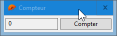
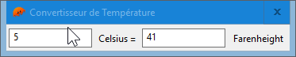
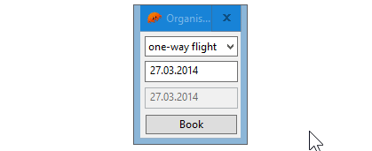
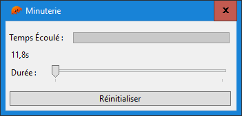
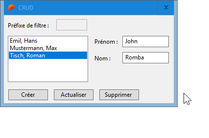

# WinSafe 7GUIs

Exemples [7GUIs](https://eugenkiss.github.io/7guis/tasks) écrits en Rust en utilisant le crate [WinSafe](https://github.com/rodrigocfd/winsafe).

Lancez les exemples en exécutant `cargo run` dans chaque dossier.

Personnellement, j'édite les fichiers de ressources en utilisant [Resource Hacker™](http://www.angusj.com/resourcehacker).

## Compteur

## Convertisseur de Tempèrateur

## Organisateur de Vols

:information_source: Fond rouge pour les entrées non valides non mises en œuvre. :information_source:

## Minuterie

:construction: En construction ! :construction:

## CRUD 

:information_source: Filtre non implémenté. :information_source: 

:construction: En construction ! :construction:

